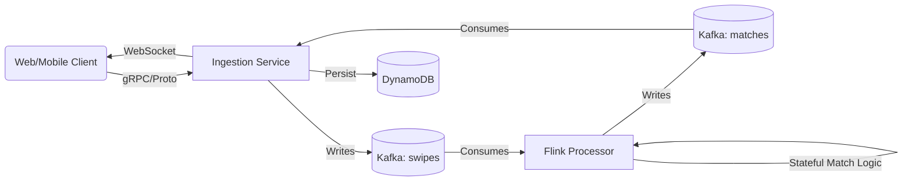

# Pulse Engine


**Pulse** is a high-frequency, real-time matching engine designed to process high-throughput user interactions with low latency. It leverages event-driven architecture to ingest millions of events, process them statefully, and deliver instant feedback to clients.

## 🏗 Architecture

Pulse adopts a modern, decoupled microservices architecture:



## 🚀 Tech Stack

- **Core Backend**: Java 17, Spring Boot 3
- **Stream Processing**: Apache Flink 1.18
- **Messaging**: Apache Kafka (Confluent Platform)
- **Protocol**: gRPC (Ingestion), WebSockets (Real-time updates)
- **Frontend**: React, Vite (Dashboard)
- **Infrastructure**: Docker, Docker Compose

## ⚡️ Quick Start

### Prerequisites
- Docker & Docker Compose
- Java 17+ (for local development)
- Python 3.9+ (for load testing)

### Run the Engine
We provide a unified startup script that handles build, infrastructure initialization, and service orchestration.

```bash
./scripts/start_dev.sh
```

This will:
1. Clean up existing containers and artifacts.
2. Build the backend services and Flink jobs.
3. Start Kafka, Zookeeper, Flink Cluster, and DynamoDB.
4. Launch the Ingestion Service and Dashboard.

**Access Points:**
- **Dashboard**: [http://localhost:3000](http://localhost:3000)
- **Flink Dashboard**: [http://localhost:8081](http://localhost:8081)
- **API (gRPC)**: `localhost:50051`

### Load Testing
To simulate high-concurrency traffic:

```bash
python3 scripts/load_test.py
```

## 🛠 Development

### Project Structure
```
pulse/
├── application-backend/      # Core services
│   ├── pulse-ingestion/      # Spring Boot gRPC + WebSocket Service
│   ├── pulse-processor/      # Flink Job
│   └── pulse-dashboard/      # React Frontend
├── scripts/                  # Operational scripts
└── docker-compose.yml        # Infrastructure definition
```

### Configuration
Environment variables can be tuned in `docker-compose.yml`:
- `FLINK_PARALLELISM`: Controls Flink job scaling.
- `KAFKA_BOOTSTRAP_SERVERS`: Kafka connectivity.

## 📄 License
Privately licensed.
