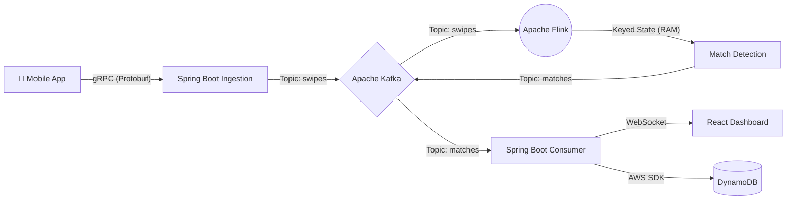

# Pulse: High-Frequency Matching Engine ⚡️

**Pulse** is a distributed, real-time backend system designed to solve the "Double Opt-In" matching problem at massive scale (10k+ events/sec). It uses **Apache Flink** for stateful stream processing to detect mutual matches instantly without database bottlenecks.

> 🎯 **The Problem**: In dating/social apps, a "match" happens when User A likes User B AND User B likes User A. Checking this in a database for every swipe is too slow at scale (10ms+ per query). Pulse solves this by keeping pending likes in memory and detecting matches in <1ms.


---

## 🚀 Key Features

| Feature | Description |
|---------|-------------|
| **High-Throughput Ingestion** | gRPC server accepting 10,000+ swipe events per second |
| **Real-Time Match Detection** | Apache Flink processes swipes in memory with <1ms latency |
| **Stateful Processing** | Pending likes stored in Flink state with 15-day TTL |
| **Durable Persistence** | Matches persisted to DynamoDB with Single-Table Design |
| **Live Dashboard** | React UI with WebSocket updates showing real-time metrics |
| **Load Testing** | Python script to simulate 10k+ concurrent users |

---

## 🛠 Tech Stack

| Layer | Technology |
|-------|------------|
| **Language** | Java 17, Python 3 |
| **API** | gRPC with Protocol Buffers |
| **Ingestion** | Spring Boot 3.x |
| **Messaging** | Apache Kafka |
| **Processing** | Apache Flink (Stateful Streaming) |
| **Database** | Amazon DynamoDB (Local) |
| **Frontend** | React 19, Vite, Tailwind CSS, Recharts |
| **Real-time** | WebSockets (STOMP) |

---

## 🏗 Architecture



### Data Flow

1. **Swipe Event** → Client sends gRPC request with `{user_id, target_id, is_like}`
2. **Ingestion** → Spring Boot validates and publishes to Kafka `swipes` topic
3. **Processing** → Flink groups by user pair, checks state for pending like
4. **Match Detection** → If mutual like found, emit to Kafka `matches` topic
5. **Persistence** → Consumer saves match to DynamoDB (2 rows per match)
6. **Notification** → WebSocket broadcasts match to connected clients

---

## 📁 Project Structure

```
pulse/
├── pulse-common/          # Shared Protobuf definitions
│   └── src/main/proto/
│       ├── swipe.proto    # SwipeRequest, SwipeResponse
│       └── match.proto    # MatchEvent
│
├── pulse-ingestion/       # Spring Boot gRPC Server
│   └── src/main/java/
│       ├── service/
│       │   ├── SwipeIngestionService.java  # gRPC endpoint
│       │   └── MatchConsumerService.java   # Kafka consumer + DynamoDB
│       ├── config/
│       │   └── DynamoConfig.java           # AWS SDK configuration
│       └── repository/
│           └── TableInitializer.java       # DynamoDB table setup
│
├── pulse-processor/       # Apache Flink Job
│   └── src/main/java/
│       ├── MatchingJob.java    # Flink pipeline definition
│       ├── MatchFunction.java  # Match detection logic
│       ├── model/              # SwipeEvent, MatchEvent POJOs
│       └── utils/              # Kafka serializers/deserializers
│
├── pulse-dashboard/       # React Frontend
│   └── src/
│       ├── App.jsx             # Main dashboard component
│       └── usePulseSocket.js   # WebSocket hook
│
├── docker-compose.yml     # Infrastructure (Kafka, DynamoDB, Flink)
├── flood.py               # Python load testing script
└── build.gradle           # Gradle multi-project build
```

---

## 🚦 Getting Started

### Prerequisites

- **Docker Desktop** (for Kafka, DynamoDB)
- **Java 17+** (for Spring Boot & Flink)
- **Node.js 18+** (for React dashboard)
- **Python 3.8+** (for load testing)
- **grpcurl** (optional, for manual testing)

### 1. Start Infrastructure

```bash
# Start Kafka, Zookeeper, DynamoDB, and Flink
docker-compose up -d

# Verify all containers are running
docker ps
```

**Services started:**
| Service | Port | Description |
|---------|------|-------------|
| Kafka | 9092 | Message broker |
| DynamoDB Local | 8000 | Database |
| DynamoDB Admin | 8001 | Database UI |

### 2. Start the Flink Processor

```bash
# Terminal 1: Start the match detection engine
./gradlew :pulse-processor:run
```

You should see:
```
Pulse Engine is starting...
Source: Kafka Source -> ... switched from CREATED to RUNNING
```

### 3. Start the Ingestion Service

```bash
# Terminal 2: Start the gRPC server
./gradlew :pulse-ingestion:bootRun
```

You should see:
```
gRPC Server started, listening on address: *, port: 9090
Table 'pulse_core' created successfully!
```

### 4. Start the Dashboard (Optional)

```bash
# Terminal 3: Start the React UI
cd pulse-dashboard
npm install
npm run dev
```

Open: http://localhost:5173

### 5. Test with gRPC

```bash
# Send first swipe (Alice likes Bob)
grpcurl -plaintext -d '{
  "user_id": "alice",
  "target_id": "bob",
  "is_like": true,
  "timestamp": 1733600000
}' localhost:9090 com.pulse.grpc.SwipeService/Swipe

# Send reciprocal swipe (Bob likes Alice) - triggers MATCH!
grpcurl -plaintext -d '{
  "user_id": "bob",
  "target_id": "alice",
  "is_like": true,
  "timestamp": 1733600001
}' localhost:9090 com.pulse.grpc.SwipeService/Swipe
```

**Expected output in Flink terminal:**
```
Stored swipe: alice is waiting for bob
MATCH DETECTED: alice <--> bob
```

### 6. Verify in DynamoDB

Open http://localhost:8001 to see the `pulse_core` table with match records.

---

## 🧪 Load Testing

The `flood.py` script simulates realistic dating app traffic with multiple scenarios:

```bash
# Install dependencies
pip install grpcio grpcio-tools faker

# Generate Python gRPC stubs (if not present)
python -m grpc_tools.protoc -I pulse-common/src/main/proto \
  --python_out=. --grpc_python_out=. \
  pulse-common/src/main/proto/swipe.proto

# Run the load test
python flood.py
```

**Test Scenarios:**
- **Serial Swiper**: One user rapidly swipes 5 people
- **Love Triangle**: A→B, B→C, C→A (no matches)
- **Influencer**: 10 users swipe one popular user (hot key)
- **True Match**: Reciprocal swipes that trigger matches

**Expected Output:**
```
🌊 UNLEASHING CHAOS on localhost:9090 with 20 threads...
🚀 Speed: 3500 swipes/sec | Total Swipes: 35000 | Expected Matches: 1200
```

---

## 🔧 Configuration

### Environment Variables

| Variable | Default | Description |
|----------|---------|-------------|
| `KAFKA_BOOTSTRAP_SERVERS` | `localhost:9092` | Kafka broker address |
| `FLINK_PARALLELISM` | `1` | Flink task parallelism |
| `DYNAMODB_ENDPOINT` | `http://localhost:8000` | DynamoDB endpoint |
| `GRPC_SERVER_PORT` | `9090` | gRPC server port |
| `SERVER_PORT` | `8080` | HTTP server port |

### Kafka Topics

| Topic | Partitions | Description |
|-------|------------|-------------|
| `swipes` | 1 | Raw swipe events from clients |
| `matches` | 1 | Detected matches from Flink |

### DynamoDB Schema

**Table:** `pulse_core`

| Key | Type | Example | Description |
|-----|------|---------|-------------|
| PK | String | `USER#alice` | Partition key (user ID) |
| SK | String | `MATCH#1733600000` | Sort key (timestamp) |
| partner_id | String | `bob` | The other user in match |
| match_id | String | `uuid-xxx` | Unique match identifier |

---
