# Pulse: High-Frequency Matching Engine ⚡️

**Pulse** is a distributed, event-driven backend system designed to handle the "Double Opt-In" problem at scale (10k+ events/sec). It uses **Apache Flink** for stateful stream processing to detect matches in real-time without burdening the primary database.


## 🚀 Key Features
* **High-Throughput Ingestion:** gRPC server capable of accepting 10,000 concurrent swipe events per second.
* **Stateful Processing:** Apache Flink engine that manages "Pending Likes" in memory with a 15-day TTL.
* **Real-Time Feedback:** WebSocket integration pushes match notifications to the client in <10ms.
* **Write-Optimized Storage:** DynamoDB Single-Table Design with write-amplification for O(1) read performance.

## 🛠 Tech Stack
* **Language:** Java 17, Python (Load Testing)
* **Core:** Spring Boot 3.x, gRPC (Protobuf)
* **Streaming:** Apache Kafka, Apache Flink
* **Database:** DynamoDB (Local)
* **Frontend:** React, Tailwind, Recharts, WebSockets

## 🏗 Architecture

```mermaid
graph LR
    Client[📱 Mobile App] -- gRPC (Protobuf) --> Ingestion[Spring Boot Ingestion]
    Ingestion -- "Topic: swipes" --> Kafka{Apache Kafka}
    Kafka -- "Topic: swipes" --> Flink((Apache Flink))
    Flink -- "Keyed State (RAM)" --> MatchLogic[Match Detection]
    MatchLogic -- "Topic: matches" --> Kafka
    Kafka -- "Topic: matches" --> Consumer[Spring Boot Consumer]
    Consumer -- WebSocket --> Dashboard[React Dashboard]
    Consumer -- AWS SDK --> DynamoDB[(DynamoDB)]
```



## 🚦 Getting Started

### Prerequisites
* Docker & Docker Compose
* Java 17+
* Node.js 18+

### 1. Start the Infrastructure
```bash
docker-compose up -d
```
---
